# End-to-End CI/CD Pipeline Implementation with Jenkins, Groovy, and Gradle

Deploy Spring Boot App on EKS Cluster using Jenkins' is a DevOps project focused on simplifying the development, deployment, and management of applications on AWS. It uses popular tools like GitHub, AWS, Terraform, Ansible, Docker, OWASP, and Jenkins to create a strong foundation for efficient and scalable DevOps workflows.

## Architecture 


## Purpose
The purpose of this project is to establish a seamless and automated process for deploying a Spring Boot application on an Amazon EKS cluster using Jenkins. By leveraging industry-standard DevOps tools such as GitHub, AWS, Terraform, Ansible, Docker, and OWASP, this initiative aims to improve the efficiency, security, and scalability of application deployment. It focuses on reducing manual effort, minimizing errors, and ensuring a reliable, repeatable process for managing applications in the AWS environment.


## How to execute the project ?
```
git clone https://github.com/MohamedGouda99/Senior-CI-CD-Pipeline-Developer-Task.git
aws configure
terraform -chdir=IAC init
terraform -chdir=IAC plan
terraform -chdir=IAC apply --auto-approve 
```
## Configure Tokens
### Run ansible playbook to get jenkins token to be able to login
```
ansible-playbook -i inventory/aws_ec2.yml project_playbook.yml
``` 
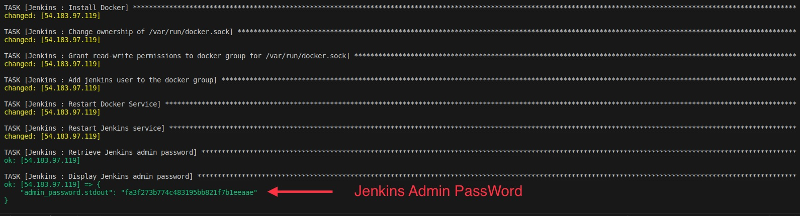

### Configure docker token to use it with jenkins

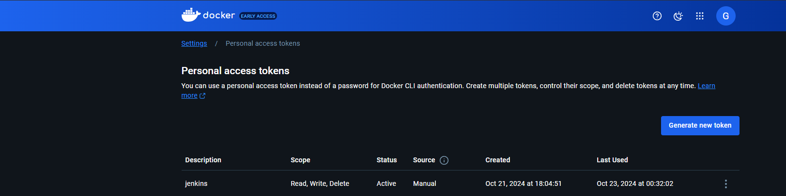

### Configure GitHub Token to authenticate it with jenkins

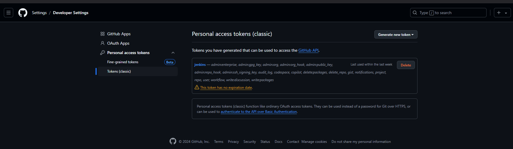

### Configure GitHub webhook to integrate changes automatically with jenkins

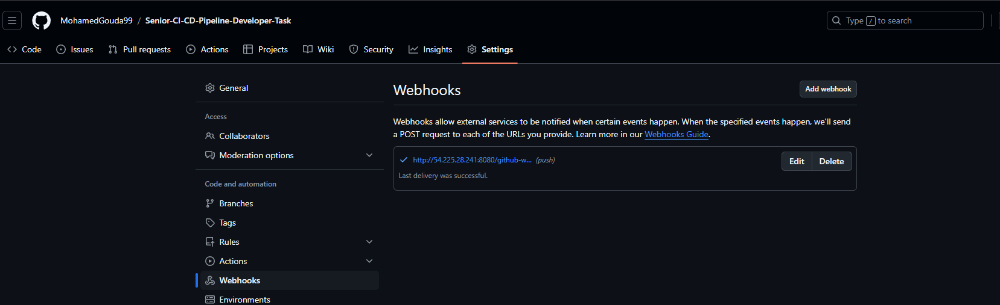

### Configure all previous credentials in jenkins

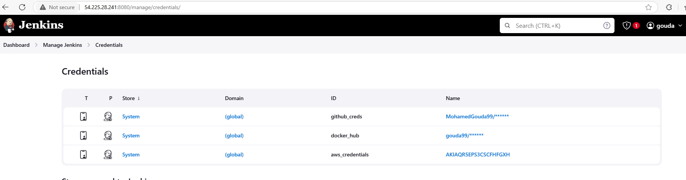

### Install the following Plugins as well

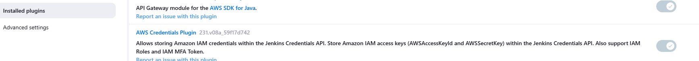
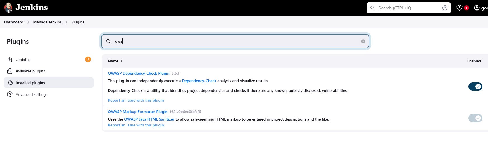

### Setup your pipeline like the following screenshots

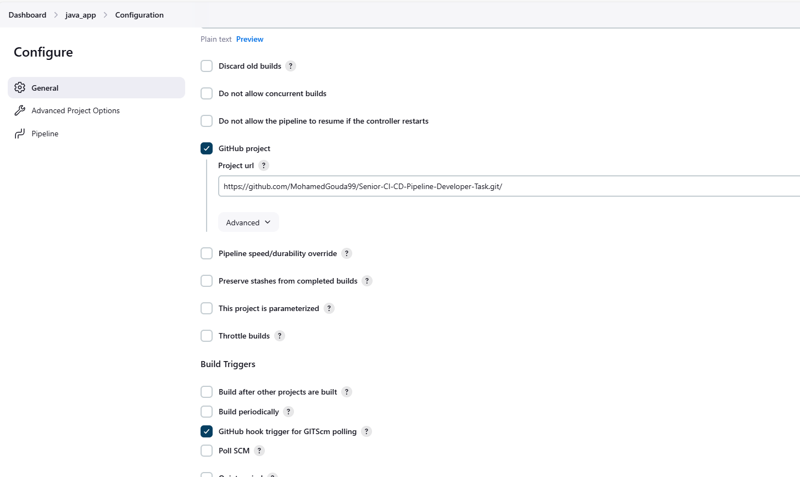
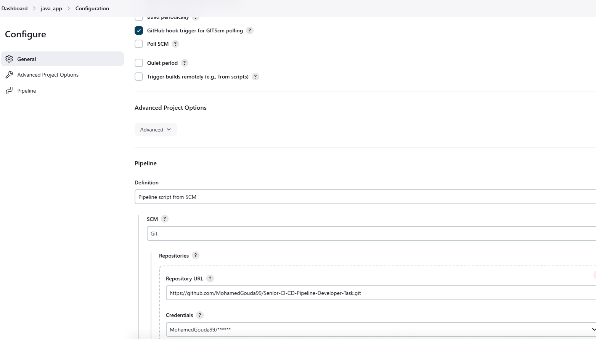

#### Then click on Build now to execute your pipeline.
## Note if you want to detect vulnerabilities then stop your pipeline edit script.groovy and uncomment the following function

```
def performSecurityScan() {
    echo "Running OWASP Dependency Check..."
    
    // Define the path for Dependency-Check installation
    def dependencyCheckHome = "${env.WORKSPACE}/dependency-check"
    def reportFile = "${env.WORKSPACE}/dependency-check-report.xml"
    
    // Clean up the previous installation, download, and unzip the latest version
    echo "Cleaning up previous Dependency-Check installation..."
    sh "rm -rf ${dependencyCheckHome}"
    sh "mkdir -p ${dependencyCheckHome}"
    
    echo "Downloading Dependency-Check..."
    sh "wget https://github.com/jeremylong/DependencyCheck/releases/download/v8.4.0/dependency-check-8.4.0-release.zip -P ${dependencyCheckHome}"
    
    echo "Unzipping Dependency-Check..."
    sh "unzip -o ${dependencyCheckHome}/dependency-check-8.4.0-release.zip -d ${dependencyCheckHome}"
    
    // Run the OWASP Dependency-Check and generate the report
    echo "Running Dependency-Check scan..."
    sh "${dependencyCheckHome}/dependency-check/bin/dependency-check.sh --format XML --out ${reportFile} --scan . --disableKnownExploited"
    
    // Check the generated report for vulnerabilities
    echo "Checking Dependency-Check report for vulnerabilities..."
    def vulnerabilitiesFound = sh(script: "grep '<severity>' ${reportFile} | grep -i 'Critical\\|High\\|Medium'", returnStatus: true)
    
    if (vulnerabilitiesFound == 0) {
        error "Dependency-Check found vulnerabilities. Failing the build."
    } else {
        echo "No critical or high vulnerabilities found. Proceeding with the build."
    }
    
    echo "OWASP Dependency Check complete."
}
```

##### This is will be the output

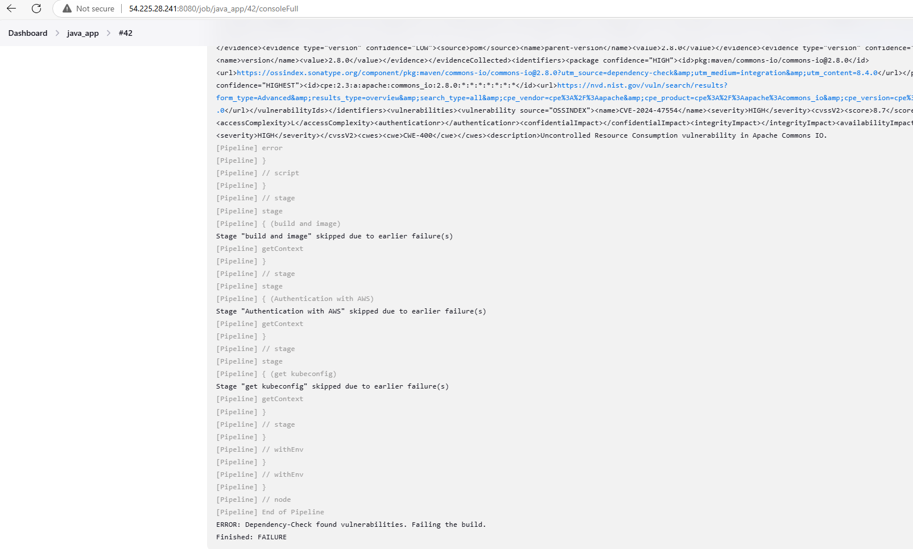

### If not use the standard script.

# Successfull Execution
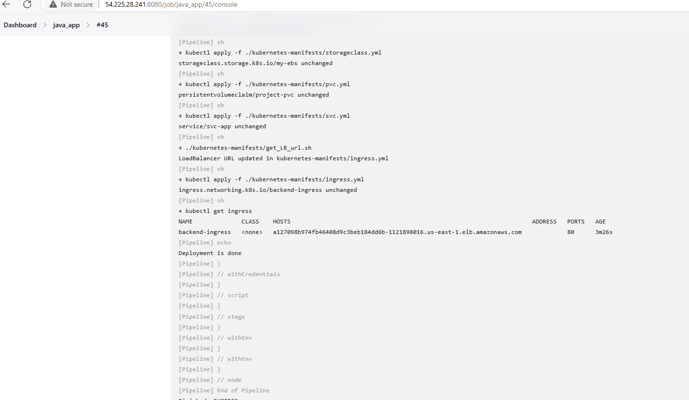
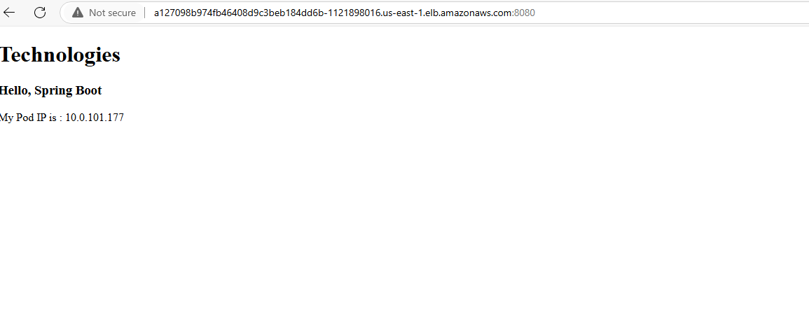